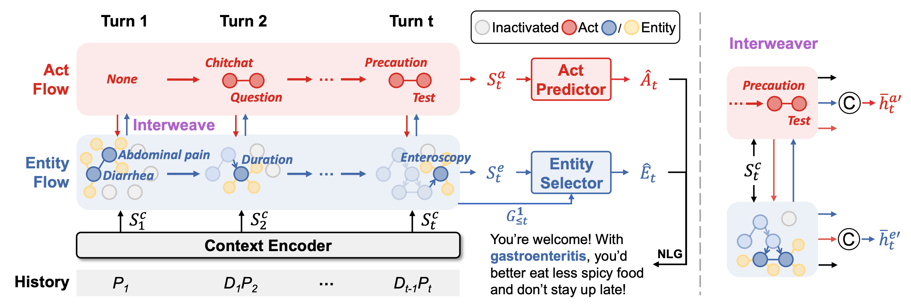

# DFMed: Medical Dialogue Generation via Dual Flow Modeling
This is the code for ACL 2023 Findings paper: [*Medical Dialogue Generation via Dual Flow Modeling*](https://arxiv.org/abs/2305.18109) by Kaishuai Xu, Wenjun Hou, Yi Cheng, Jian Wang, and Wenjie Li.

**DFMed** is a novel medical dialogue generation framework, which models the transitions of medical entities and dialogue acts via step-by-step interweaving.



## Requirements
Please create a new conda env and install the following pytorch version and main requirement packages (others are in the file). 
```
conda create -n dual_flow python=3.8
conda activate dual_flow

pip install torch==1.10.1+cu113 torchvision==0.11.2+cu113 torchaudio==0.10.1 --extra-index-url https://download.pytorch.org/whl/cu113
```
- `transformers==4.24.0`
- `nltk==3.4.1`
- `rouge==1.0.1`
- `setuptools==59.5.0`
- `numpy`

Please note that the `nltk` version is important for calculating BLEU.
## Data and Checkpoints
Download the data through:
```
sh download_data.sh
```
Download the fine-tuned generation checkpoints through:
```
sh download_checkpoint.sh
```
Download the fine-tuned dual flow learning checkpoints through: \
MedDG at [Dropbox](https://www.dropbox.com/scl/fi/aol4jav6mjb25p2x1sekn/test_meddg.tar.gz?rlkey=6fbr2pz4gia8tmduzbibqlbqj&dl=0) \
KaMed at [Dropbox](https://www.dropbox.com/scl/fi/m73ri6kit8u6xjc79ol8k/test_kamed.tar.gz?rlkey=p5rqv1okcqzl7jjvrm0m1zhee&dl=0)

The final directory is as follows:
```
└── DFMed
    ├── dual_flow
    ├── generation
    ├── df_results
    ├── data
    ├── images
    ├── download_checkpoint.sh
    ├── download_data.sh
    └── requirements.txt
```

## Implementations
1. Train the dual flow learning model.
```
cd dual_flow

# For the MedDG dataset
sh train_meddg.sh

# For the KaMed dataset
sh train_kamed.sh
```
2. Get act and entity predictions from the checkpoints of top performance.
```
sh get_prediction_topk.sh
```
3. Train the generation model.
```
cd generation

# For the MedDG dataset
sh train_meddg.sh

# For the KaMed dataset
sh train_kamed.sh
```
4. Inference. The `df_results` directory contains act and entity predictions of our training.
```
cd generation

# For the MedDG dataset
sh eval_meddg.sh

# For the KaMed dataset
sh eval_kamed.sh
```
5. Calculate metrics. We use the algorithm presented by the official [code](https://github.com/lwgkzl/MedDG/blob/master/MedDG/generation/CY_DataReadandMetric.py) of the MedDG dataset.
```
python metrics.py --hp ./generate.txt --rf ./reference.txt
```
## Cite
If you use our codes or your research is related to our work, please kindly cite our paper:
```
@inproceedings{xu-etal-2023-medical,
    title = "Medical Dialogue Generation via Dual Flow Modeling",
    author = "Xu, Kaishuai  and
      Hou, Wenjun  and
      Cheng, Yi  and
      Wang, Jian  and
      Li, Wenjie",
    booktitle = "Findings of the Association for Computational Linguistics: ACL 2023",
    year = "2023",
    address = "Toronto, Canada",
    publisher = "Association for Computational Linguistics",
    url = "https://aclanthology.org/2023.findings-acl.423",
    doi = "10.18653/v1/2023.findings-acl.423",
    pages = "6771--6784",
}
```